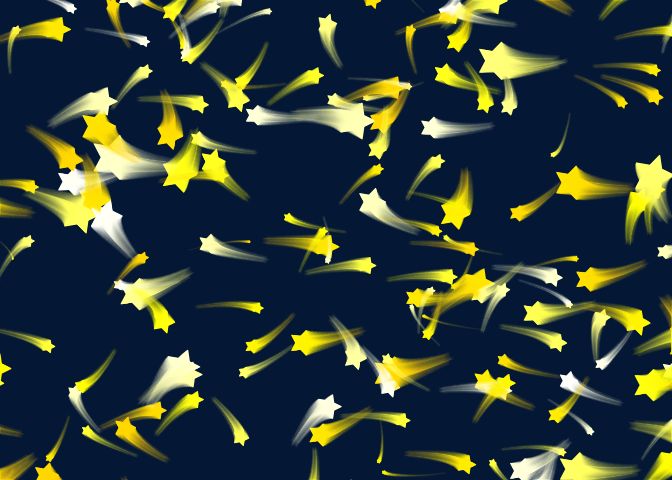
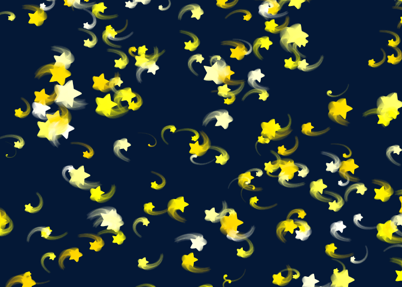
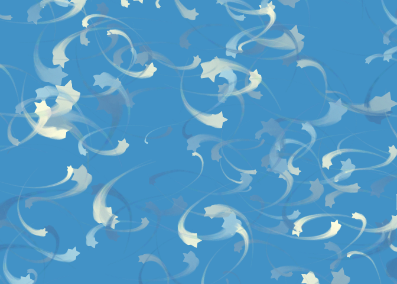

<!-- README.md is generated from README.Rmd. Please edit that file -->
twinkle
=======

Motivated by [@ikashnitsky](https://twitter.com/ikashnitsky), who [shared the snowflakes](https://twitter.com/ikashnitsky/status/937786580231696384) he made for his 3yo daughter, I created this R package that does something similar with one of Mateo's, my 2yo, favorite things, stars :).

Install
=======

To install it you can use `devtools`

``` r
devtools::install_github("gvegayon/twinkle")
```

Example
-------

This is a basic example which shows you how to solve a common problem: drawing a sky full of stars

``` r
library(twinkle)
set.seed(1)
twinkle()
```



If you don't like the tails, then set `tail = 1`

``` r
set.seed(1)
twinkle(tail = 1)
```


If You want to get more *curvy* tails, just change the `deg_to` option

``` r
set.seed(1)
twinkle(deg_to = pi, deg_from = 0)
```



You can also play with the colors

``` r
set.seed(1)
twinkle(
  tail = 300,
  col_decay_rate = 5,
  deg_to   = pi/2,
  deg_from = -pi,
  bg   = blues9[6],
  cols = c("lightyellow", "steelblue", "lightblue")
  )
```


