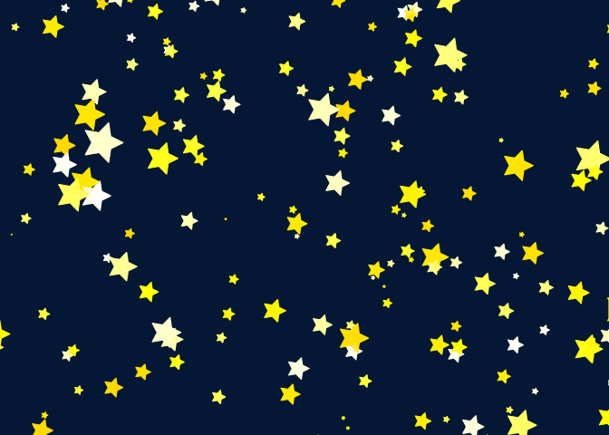

<!-- README.md is generated from README.Rmd. Please edit that file -->
twinkle
=======

Motivated by [@ikashnitsky](https://twitter.com/ikashnitsky) who [shared the snowflakes](https://twitter.com/ikashnitsky/status/937786580231696384) that he made for his 3yo daughter, I created this R package that does somethign similar with one of Mateo's, my 2yo, favorite things, stars :).

Example
-------

This is a basic example which shows you how to solve a common problem: drawing a sky full of stars

``` r
library(twinkle)
set.seed(1)
twinkle()
```


If you don't like the tails, then set `tail = 1`

``` r
set.seed(1)
twinkle(tail = 1)
```



If You want to get more *curvy* tails, just change the `deg_to` option

``` r
twinkle(deg_to = pi, deg_from = 0)
```


